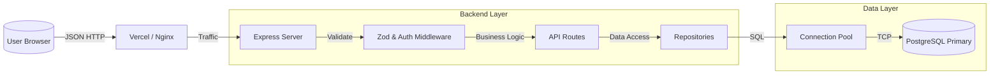

# VitaZone Developer Handbook

> **Version**: 3.0.0 (Commercial Poland Release)
> **Status**: Production Ready
> **Maintained By**: Engineering Team
> **Last Updated**: January 2026

---

## 📖 Introduction
Welcome to the **VitaZone** technical documentation. This project is not just an e-commerce demo; it is a **reference implementation** of a modern, secure, and scalable web application.

Unlike typical tutorials that user "shortcuts" (like storing direct JSON, weak passwords, or no validation), VitaZone forces **Enterprise Patterns** from day one. This handbook explains strictly *how* and *why* every line of code exists.

### Core Philosophy
1.  **Fail Fast**: If a configuration is missing, the server crashes immediately (via `envalid`). We do not allow "undefined" behavior in production.
2.  **Strict Layering**: The API Controller never speaks to the Database directly. It *must* go through a Repository.
3.  **Trust No One**: Every input is validated (Zod), every route is rate-limited, and every header is secured (Helmet).
4.  **Data Integrity**: Money is stored as integers (`cents`). Orders are created in ACID transactions.

---

## 🏗️ System Architecture

### 1. The Stack
We selected this stack to balance **Developer Experience (DX)** with **Performance**.

| Layer | Technology | Decision Rationale |
|-------|------------|--------------------|
| **Frontend** | React 19 + Vite | React 19 introduces Actions and better hydration. Vite provides instant HMR (Hot Module Replacement) compared to Webpack. |
| **Styling** | Tailwind CSS | Utility-first CSS reduces bundle size and enforces a consistent design system (colors, spacing). |
| **Backend** | Express.js (ESM) | The industry standard for Node.js REST APIs. We use ES Modules (`import/export`) for consistency with the frontend. |
| **Database** | PostgreSQL 17 | Relational integrity (Foreign Keys) is critical for e-commerce. NoSQL is unsuitable for complex order/inventory relations. |
| **ORM** | None (pg + SQL) | We use raw SQL via `node-postgres` to show exactly what queries are executing. This teaches "SQL Literacy". |
| **Validation** | Zod | Runtime schema validation. It guarantees that `req.body` matches our expectations before we even touch business logic. |
| **Analytics** | Vercel Analytics | Privacy-friendly, real-time traffic insights integrated directly into the `App` component. |

### 2. High-Level Data Flow


---

## 💾 Database Schema Deep Dive
The database is the "Source of Truth". If data is wrong here, the whole app is wrong.

### 1. `users` Table
Identity management.
- `id` (UUID): We use `gen_random_uuid()` to prevent ID enumeration attacks.
- `password_hash` (VARCHAR): Stores Bcrypt hash (not plain text!).
- `role` (VARCHAR): simple RBAC ('user' vs 'admin').

### 2. `addresses` Table (New in v2)
Separated from users to allow multiple addresses in the future (currently 1:1 via `is_default` flag).
- `user_id` (FK): Links to `users.id`. `ON DELETE CASCADE` means if we delete a user, their address vanishes.

### 3. `products` Table
Inventory management.
- `price_cents` (INTEGER): **CRITICAL**. We store $19.99 as `1999` cents.
    - *Why?* Floating point math is broken in binary (`0.1 + 0.2 !== 0.3`). Integers are safe.
- `stock` (INTEGER): Used for atomic decrementing.
- `specs` (JSONB): Allows flexible attributes (e.g., "Venom Potency" for snakes vs "Material" for tanks) without altering the schema.

### 4. `orders` & `order_items`
The ledger of sales.
- `orders` contains the "Header" (Who, Where, Status, Total).
- `order_items` contains the "Lines" (Product X, Qty 2, Price at Moment of Purchase).
    - *Note*: We copy `price_at_purchase_cents` from the product to the order item. If the product price changes later, the historical order must remain unchanged.

---

## 🛠️ Backend Internals (`server.js`)

The `server.js` file is the entry point. Let's analyze the critical sections.

### 1. Startup Validation
```javascript
import env from './server/config/env.js';
// ...
const PORT = env.PORT; // If PORT is missing, app crashes HERE.
```
We use `envalid` to check `process.env` before the app boots. This prevents "undefined" errors at 3 AM.

### 2. Security Middleware
```javascript
app.use(helmet()); // Sets headers like X-Frame-Options (prevents clickjacking)
const authLimiter = rateLimit({ ... }); // Slows down brute-force attacks
app.use('/api/auth/', authLimiter);
```
We actively defend against attackers scanning for vulnerabilities.

### 3. Global Error Handler
```javascript
app.use(errorHandler);
```
app.use(errorHandler);
```
**Never** let an unhandled error crash the server. This middleware catches all synchronous and asynchronous errors, logs them to Winston (JSON), and returns a safe `500 Internal Server Error` to the user without leaking stack traces.

### 4. Database Backups
A dedicated script `server/scripts/dump_db.js` is provided to generate transactional dumps using `pg_dump`. This ensures we can recover from catastrophic failures.

---

## 🏛️ Repository Architecture

This is the most important pattern in the application.

### Why not write SQL in the Controller?
**Bad (Controller)**:
```javascript
app.get('/users/:id', async (req, res) => {
   const result = await db.query('SELECT * FROM users...'); // SQL leaking into HTTP layer
   // What if we switch to Mongo? We have to rewrite the controller.
});
```

**Good (Repository)**:
```javascript
// repository/userRepository.js
export const findById = (id) => db.query('SELECT ...', [id]);

// server.js
const user = await userRepo.findById(req.params.id);
```

### Deep Dive: `orderRepository.createOrder`
This function is a masterclass in **ACID Transactions**.

```javascript
export const createOrder = async (orderData) => {
    const client = await db.poolInstance.connect(); // Get exclusive client
    
    try {
        await client.query('BEGIN'); // Start Transaction

        // 1. Check Stock (Locking)
        // We use FOR UPDATE to prevent "Double Spend" race conditions.
        // If 2 users try to buy the last Item X at the exact same millisecond,
        // SQL will force them to queue one by one.
        const stockCheck = await client.query(
            'SELECT stock FROM products WHERE id = $1 FOR UPDATE', 
            [item.productId]
        );

        // 2. Create Header
        const orderResult = await client.query('INSERT INTO orders...');

        // 3. Create Items
        // We loop and insert line items linked to the orderId.

        await client.query('COMMIT'); // Commit all changes together
    } catch (e) {
        await client.query('ROLLBACK'); // If ANYTHING failed, undo everything
        throw e;
    }
}
```
**Takeaway**: An order is never created if stock is missing, and stock is never deducted if the order fails.

---

## ⚛️ Frontend Architecture

### 1. Directory Structure
- `/components`: Dumb UI components (Buttons, Inputs). They don't know about API.
- `/pages`: Smart components. They connect UI + Data.
- `/context`: Global state (User session, Cart).

### 2. `AuthContext.jsx` Explained
This component manages the user's identity across the app.

**Key Feature: Session Restoration**
```javascript
useEffect(() => {
    const restoreSession = async () => {
        const token = localStorage.getItem('exotic_token');
        if (token) {
             // We verify the token is still valid by calling the API
             const res = await fetch('/api/users/me', ...);
             if (res.ok) setUser(userData);
             else logout(); // Token expired or invalid
        }
    }
}, []);
```
This ensures that if you refresh the page, you stay logged in, but if your token was revoked on the server, you are logged out immediately.

**Security Note (v3.0)**: We strictly use **HttpOnly Cookies** for token transport. The frontend never sees the JWT payload. All fetch requests use `credentials: 'include'`.

### 3. `CartContext.jsx`
Uses `localStorage` to persist the cart items.
- `addToCart(product)`: Adds item or increments quantity if exists.
- `cartTotal`: Derived state. Calculates sum of `price * quantity` on the fly.

---

## 🔌 API Reference

### Products
- **GET** `/api/products`
    - Returns: `Array<Product>`
    - Public access.
- **GET** `/api/products/:id`
    - Returns: `Product`
- **POST** `/api/admin/products`
    - Protected: `Admin` only.
    - Body: `{ name, price, stock, category, description, image_urls[] }`

### Authentication
- **POST** `/api/auth/register`
    - Body: `{ email, password, name }`
    - Returns: `{ accessToken, user }`
- **POST** `/api/auth/login`
    - Body: `{ email, password }`
    - Returns: `{ user }` (Token attached as HttpOnly Cookie)

### Users
- **GET** `/api/users/:id`
    - Protected: Self or Admin.
    - Returns: `{ id, email, role, street, city... }`
- **PUT** `/api/users/:id`
    - Body: `{ street, city, country, phone... }`
    - Updates profile and address simultaneously using `userRepository.updateById`.

### Orders
- **POST** `/api/orders`
    - Protected: Authenticated User.
    - Body: `{ items: [], shipping: {}, total }`
    - Logic: Triggers the Transactional Order Flow.

---

## 🛡️ Security Manual

### 1. SQL Injection
**Threat**: Attacker inputs `' OR 1=1 --` to bypass login.
**Defense**: We use Parameterized Queries (`$1, $2`) in `db.query()`. The database driver escapes all input, treating it as data, not code.

### 2. XSS (Cross Site Scripting)
**Threat**: Attacker puts `<script>alert('hack')</script>` in their username.
**Defense**: 
- **React** automatically escapes all variables rendered in JSX `{variable}`.
- **CSP**: `helmet` sets Content Security Policy headers to block malicious scripts.

### 3. DoS (Denial of Service)
**Threat**: Botnet spams `/api/auth/login` to crash server.
**Defense**: `express-rate-limit` blocks IP addresses creating too many requests (limit: 100/15min).

### 4. Privilege Escalation
**Threat**: User changes their role to 'admin' in JSON payload.
**Defense**: `userRepository.updateById` explicitly filters allowed fields. It only allows updating profile fields (`name`, `address`), ignoring `role` or `id` in the input.

---

## ⚖️ Legal Compliance (Polish Law / UOKiK)

### 1. Granular Consents
Users must explicitly consent to Terms/Privacy and optionally to Newsletter. These are stored in a dedicated `legal_consents` table with IP and Timestamp.

### 2. Right of Withdrawal (Art. 38)
Since we sell **Live Animals**, we are exempt from the standard 14-day return policy (Art. 38 Ustawy o prawach konsumenta). A clear warning is displayed:
- On the Product Page
- In the Cart Drawer
- At Checkout

---

## 🚀 DevOps & Deployment

### Production Checklist
1.  **Set Environment**: Ensure `NODE_ENV=production`.
2.  **Database**: Migrate schema on the specific production DB (Neon).
3.  **Secrets**: Set complex `JWT_SECRET` (64+ chars).
4.  **Logs**: Monitor Winston logs (stdout) via your hosting provider (Vercel/Railway).

### Scaling Strategy
- **Database**: PostgreSQL can handle 10k+ concurrent connections with proper pooling (which `db.js` provides via `pg.Pool`).
- **Backend**: Express is stateless. You can spin up 10 instances of this server behind a Load Balancer found on platforms like Vercel or AWS ECS.

---

**End of Handbook**
*For any questions, refer to the `ARCHITECTURE_DECISIONS.md` for the "Why" behind these choices.*
